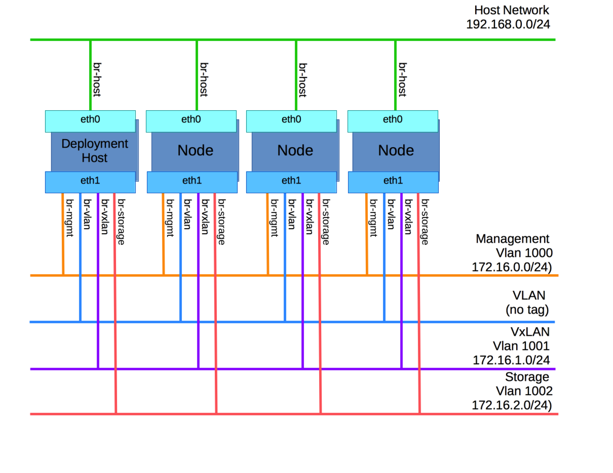

# osa-playground
## Overview
Playground to understand and develop OpenStack Ansible.

## Getting Started
### Required Setup
This test bed uses VirtualBox to run Ubuntu 14.04 VMs to emulate servers in an OpenStack cluster configuration.  The version of VirtualBox used is 4.3.36r105129.  Newer versions of VirtualBox should operate in a similar manner.

The testbed VMs include:
  * Deployment Host - runs OpenStack Ansible
  * Target nodes - 5 VMs on which to deploy OpenStack

### Deployment Host
These instructions are following the steps prescribed by http://docs.openstack.org/developer/openstack-ansible/liberty/install-guide/deploymenthost-add.html
  1.  Install required packages  
    ```
    $ sudo bash
    
    $ apt-get install aptitude build-essential git ntp ntpdate openssh-server python-dev sudo
    ```
  2.  git openstack ansible (decided to try the master branch...could have gone with either kilo or liberty)  
    ```
    $ mkdir /opt/openstack-ansible
    
    $ git clone -b master https://github.com/openstack/openstack-ansible.git /opt/openstack-ansible
    
    $ cd /opt/openstack-ansible
    
    $ scripts/bootstrap-ansible.sh
    ```
  3.  Setup ssh keys  
    1.  Create key using ssh-keygen with no password.  Use osa-key as a name for the key (not id_rsa if running on local machine)
    2.  Push out keys to server vms and deployment vm.  File pushkeys.sh can be an example on doing this simply.
    3.  Test passwordless ssh between deployment machine and nodes. (you may need to indicte your identity with the '-i' option pointing to the private key)


### Target Nodes
The basic steps for preparing the nodes for OpenStack Ansible are:
 1. Install Ubuntu
 2. Install required software packages
 3. Configure networking
 4. Setup LVM on node1

#### Install Ubuntu
Installing Ubuntu for the playground can be performed by attaching an ISO to the VM prior to start.  Following the onscreen directions will get you a running Ubunut VM.  If you use the [script](./create-node-vm.sh) that creates the VM (create-node-vm.sh), then you need to choose __eth2__ as the primary interface.  Otherwise, the install will not complete successfully as the internet will be unreachable.  Once the base install is complete, you may need to configure eth0 so that you can make use of the [playbook](./nodes-playbook.yml) in the next step.

#### Install required software packages
In the spirit of using Ansible, a [playbook](./nodes-playbook.yml) was developed to prepare the nodes for deployment.  As an added bonus running the the playbook will identify any issues you may have with passwordless ssh, internet connectivity, etc... before you run the OpenStack Ansible playbooks.  

**NOTE: You will need to update the [hosts](./hosts) file with the IP addresses and usernames that correspond to your nodes.  Also, it is recommended that you run Ansible from a separate deployment host.**

```
$ ansible-playbook --private-key={key filename} -i ./hosts nodes-playbook.yml
```

Once the playbook is successful for all nodes, reboot the nodes

```
ansible all --private-key={key filename} -i ./hosts -a '/sbin/reboot' --become --become-user root
```

#### Configure Networking
First we need to configure the "front channel" bridge, br-host.  This will be on eth0 if you have been using the scripts and conventions of this repo.  In the following snippet, the eth0 interface is commented out and the _source_ line has been added.

```
# This file describes the network interfaces available on your system
# and how to activate them. For more information, see interfaces(5).

# The loopback network interface
auto lo
iface lo inet loopback

#auto eth0
#iface eth0 inet static
#  address 192.168.0.101
#  netmask 255.255.255.0

# The primary network interface
auto eth2
iface eth2 inet dhcp

source /etc/network/interfaces.d/*
```

Next the file **/etc/network/interfaces.d/ifcfg-br-host**...
```
auto br-host
  iface br-host inet static
  bridge_ports eth0
  address 192.168.0.101
  netmask 255.255.255.0
  bridge_stp off
```

Restart the interfaces...
```
$ ifconfig eth0 down; ifup br-host
```

You should not have to re-login, but you may.

Verify that you have a valid br-host with the static IP.
```
$ ip a
```

*OK*, we are now going to create the Linux bridges on _all_ nodes so that they communicate like the following diagram...(TBD insert diagram)

This repository has a [directory](./interfaces.d) that contains a single set of example network configurations. Following the next steps carefully should result in a proper network setup.
  1. Copy the files from this repository's [interfaces.d](./interfaces.d) directory to /etc/network/interfaces.d on the node
  2. Update the IP addresses in ifcfg-br-mgmt and ifcfg-br-vxlan to give these bridges IPs on the management subnet and vxlan subnet.  It may be helpful to use a convention that will help identify the node by IP on these VLAN subnets.  For example node1->172.16.0.1 (on VLAN 1000, mgmt), nodex->172.16.0.x (on VLAN 1000, mgmt) *AND* node1->172.16.1.1 (on VLAN 1001, vxlan), nodex->172.16.1.x (on VLAN 1001, vxlan)
  3. Now bring up the bridges!
  
  
  ```
$ ifup br-mgmt; ifup br-vlan; ifup br-vxlan
```
  4. Verify the bridges...
  
  ```
$ brctl show
bridge name	bridge id		STP enabled	interfaces
br-host		8000.080027d00dc1	no		eth0
br-mgmt		8000.080027760fc7	no		eth1.1000
br-vlan		8000.080027760fc7	no		eth1
br-vxlan		8000.080027760fc7	no		eth1.1001
```
  1. Done!


#### Configure LVM on Node1
We will let the first node be the Cinder storage node...
```
$ pvcreate --metadatasize 2048 /dev/sdb
$ vgcreate cinder-volumes /dev/sdb
```

#### Create LVM on Remaining Nodes
First create a partition.  In this case, we will create an LVM partition.
```
$ fdisk /dev/sdb
Command (m for help): n
Select (default p): p
Partition number (1-4, default 1): 1
Command (m for help): t
Selected partition 1
Hex code (type L to list codes): 8e
Command (m for help): p
   Device Boot      Start         End      Blocks   Id  System
/dev/sdb1            2048   104857599    52427776   8e  Linux LVM
Command (m for help): w
```

Now, create a logical volume with file system...
```
$ pvcreate /dev/sdb1
$ pvs
$ vgcreate vmsvg /dev/sdb1
$ vgs
$ lvcreate --extents 100%FREE --name vms vmsvg
$ lvs
$ mkfs.ext4 /dev/mapper/vmsvg-vms
```

Mount the volume...
```
$mkdir /vms
```
Edit /etc/fstab to have this line -> `/dev/mapper/vmsvg-vms /vms              ext4    errors=remount-ro 0       1`

```
$ mount -a
```
You should now have this...
```
$ df /vms -ha
Filesystem           Size  Used Avail Use% Mounted on
/dev/mapper/vmsvg-vms   50G   52M   47G   1% /vms
```

Do this for each of the compute nodes in your playground.

---
**STOP HERE!**
---

### Vagrant Approach (development on hold)
**NOTE: Using Vagrant introduced a few challenges that were killing progress toward the goal.  So, the testbed will be simplified to use straight VirtualBox and Ubuntu 14.04.  The Vagrant approach may be revisited and the files in this repository associated with approach will remain but will not be used until the challenges are resolved.**

~~This test bed uses Vagrant and VirtualBox running on an Ubuntu 14.04 host.  The VMs are also Ubuntu 14.04.  At the creation time of this project, Vagrant 1.7.2 was used and VirtualBox 4.3.36r105129.  Newer versions of these should work fine.~~

~~Once configured with Vagrant and VirtualBox on your host machine, please get the Ubuntu Vagrant box.~~

~~$ vagrant box add ubuntu/trusty64~~ 

~~After you have cloned this repository, run...~~

~~$ vagrant init~~
~~$ vagrant up~~
  
~~**Note: Currently, you will need to select your host's network adapter to be used by the NAT interface for the VMs.  I believe this to be a default configuration by Vagrant and will not be used in the configuration of the OpenStack network.**~~

~~You should now have a controller VM and several node VMs running in VirtualBox.~~

~~$ vagrant status~~
  
~~From there you can log into any of the VMs using...~~

~~$ vagrant ssh controller~~
~~$ vagrant ssh node1~~
  
~~You should also verify that the **data** drive for each VM has been created and mounted.~~

~~**FYI:  `vagrant destroy` can cause the loss of your hard work.  Be cautious where you save configuration files and data that you need to persist.**~~
